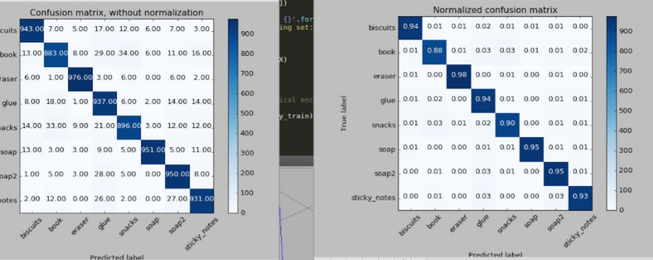
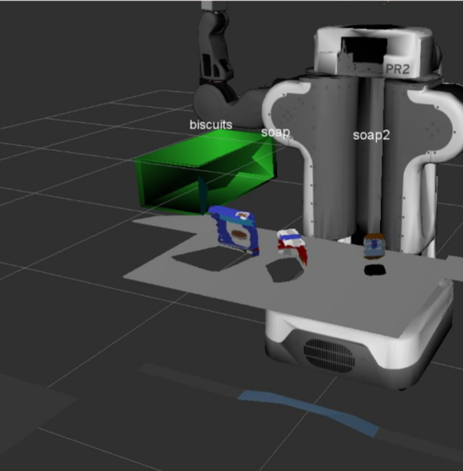
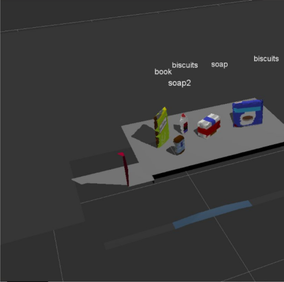
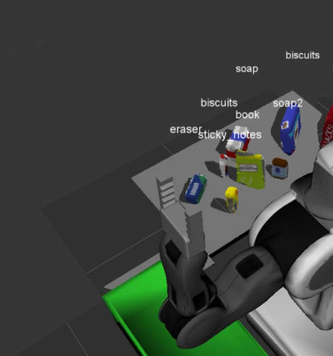

# Project Writeup

## 1. Complete Exercise 1 steps. Pipeline for filtering and RANSAC plane fitting implemented. 

### Exercise 1

 Exercise 1 involved conversion of the ROS cloud data into a PCL format. This was done by creating a VoxelGrid filter. Experimenting with the leaf size for this filter I settled on a leaf size of 0.005, 
  Step 2 was to create a pass through filter in the z axis. This allowed me to focus on areas of interest and remove all other noise. Fully removing the table edges required a min/max parameter of 0.6 and 1.3 respectively. 
  Step 3 saw the addition of a y axis pass through filter. Fully removing the drop boxes from the piont cloud required a min max value of -0.5 and 0.5 respectively.
  Finally, a RANSAC plane segmenter was added to separate the table cloud from the object point cloud. After so experimentation I found the a max_distance of 0.01 worked the best.

  
## 2. Complete Exercise 2 steps: Pipeline including clustering for segmentation implemented. 

### Exercise 2

 Exercise 2 involved separating the cloud objects into different clusters of objects. Step one was to remove colour information from and to create a white cloud. Step 2 was to preform Euclidean clustering. After some experimentation, I settled on a min/ max cluster size of 20 and 3000 respectively. I set my cluster tolerance at 0.015.
  The final step was to each of the individual RGB colour values back to the cloud and convert said cloud back to a ROS format. This format was them published to allow Rviz to visualize the data.

  
## 3. Complete Exercise 3 Steps. Features extracted and SVM trained. Object recognition implemented. 

### Exercise 3

  Exercise 3 involved implementing the compute_colour_histograms and the compute_normal_histograms. The ranges set for these histograms was [0,256] and [-1,1] for the normals. After some experimentations, I settled on a value of 32 for the bins. 
  Training the model involved using the capture_features script from exercise 3. experimenting with the number of iterations I settled on 800 iteration, More iterations, while more accurate, decreased performance too much in exchange for too little gain in accuracy. With 800 iteration I achieved a model accuracy of 0.9. Once identified, these models were then published Rviz

  

### Setup

##  For all three tabletop setups, perform object recognition, then read in respective pick list. Next construct the messages that would comprise a valid request output them to yaml format. 

  To complete detection and classification of objects pr_mover() function was used to create the .yaml output. The complete this task the code reads the object list file and then uses that list to figure out which objects should be collected. Once collected, the dropbox file is used to figure out where the objects are placed.
  The main loop then iterates over all the objects in need of collection. The object is named based on the .yaml data and converted into a datatype that ROS understands. Then the pick_pose is determined. The code then checks through all objects detected to see if the correct pick_pose.positions exists. If it does it overwrites the default pick_pose.position with the correct value.
  Next the code checks whether the group specified was red or green. Based on this, it sets the arm_name as left or right. Finally the test_scene_number is specified and a dictionary created. From this dictionary, the output .yaml file is generated.

  
### Results

  The images below show the output of the Rviz classifier for worlds 1,2 and 3 respectively. In world one, all three objects were classified correctly 90 percent of the time. While in the other two, all but one object was classified correctly most of the time. 
  
  In conclusion, with no consistent pattern as which object was misclassified, the only was I can think of to improve accuracy to to run more iterations with the capture features part. Given how more and more processing is required for less and less accuracy gain, this seems like a poor solution.

  
  

 

 
  
